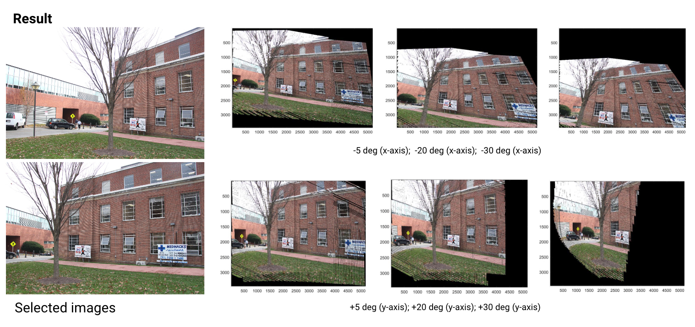

# Using_Epipolar_Line_Features_to_Generate_Newly_Calculated_Views
Google Street View does a good job in creating a virtual tour. However, users are constrained to limited viewing spots. Here we will intend to take a totally different approach from Google Street View in building a vision map for Johns Hopkins University Homewood campus by using epipolar features.

